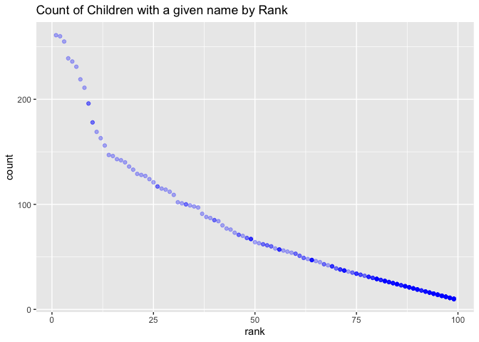

p8105\_hw2\_cz2657
================

## Problem 1

Reading and cleaning Mr. Trash Wheel sheet

``` r
library(tidyverse)
library(readxl)
```

``` r
trash_df = 
  read_excel("data/Trash-Wheel-Collection-Totals-8-6-19.xlsx", sheet = "Mr. Trash Wheel", range = "A2:N408", col_names = TRUE) %>% 
  janitor::clean_names() %>% 
  drop_na("dumpster") %>% 
  mutate(sports_balls = round(as.numeric(sports_balls)))

rain2018_df = read_excel("data/Trash-Wheel-Collection-Totals-8-6-19.xlsx", sheet = "2018 Precipitation", range = "A2:B14", col_names = TRUE) %>%
  mutate(year = 2018) %>% 
  janitor::clean_names() %>% 
  drop_na(total)

rain2019_df = read_excel("data/Trash-Wheel-Collection-Totals-8-6-19.xlsx", sheet = "2019 Precipitation", range = "A2:B14", col_names = TRUE) %>%
  mutate(year = 2019) %>% 
  janitor::clean_names() %>% 
  drop_na(total)

rain_df = full_join(rain2018_df, rain2019_df) %>% 
  mutate(month = month.name[month]) %>% 
  rename(total_precipitation_in = total)
```

The `trash_df` dataset has 344 observations and includes the variables
`weight_tons` and `volume_cubic_yards` which describe the amount of
garbage consumed by Mr. Trash Wheel. Furthermore, it provides detail
around the number of plastic bottles (`plastic_bottles`), cigarette
butts (`cigarette_butts`), and grocery bags (`grocery_bags`) consumed by
Mr. Trash Wheel. Excitingly, Mr. Trash Wheel powered up to 93.6666667
homes using the trash collected from a single dumpster. The median
number of `sports_balls` in a dumpster in 2019 was 8.5.

The `rain_df`dataset has 18 observations and includes the variables
month, total\_precipitation\_in, year. Total precipitation in 2018 was
70.33 inches.

## Problem 2

``` r
pols_df = read_csv("data/pols-month.csv") %>% 
  janitor::clean_names() %>% 
  separate(mon, into = c("year", "month", "day"), convert = TRUE) %>% 
  mutate(month = month.name[month], president = ifelse(prez_gop, "gop", "dem")) %>% 
  select (-prez_dem, -prez_gop, -day)

snp_df = read_csv("data/snp.csv") %>% 
  janitor::clean_names() %>% 
  mutate(date = as.Date(date,"%m/%d/%y ")) %>% 
  separate(date, into = c("year", "month", "day"), convert = TRUE) %>% 
  mutate(month = month.name[month]) %>% 
  select(year, month, snp_close_value = close, -day)

unemployment_df = read_csv("data/unemployment.csv") %>% 
  pivot_longer(Jan:Dec, names_to = "month") %>% 
  mutate(month = match(month, month.abb), month = month.name[month]) %>% 
  janitor::clean_names() %>% 
  rename(percent_unemployed = value)

fte_df = left_join(pols_df, snp_df, by = c("year", "month")) %>% 
  left_join(unemployment_df, by = c("year", "month"))
```

The `prez_df` dataset provides information on the number of Republican
and Democratic government officials during each month beginning in 1947,
including senators (`sen_gop` and `sen_dem`), representatives (`rep_gop`
and `rep_dem`), and governors (`gov_gop` and `gov_dem`), as well as the
party of the `president`. It has 9variables and 822 observations.

The `snp_df` dataset provides the closing value of the S&P stock index
on a given date of each month in a given year. It has 3 variables and
787 observations.

The `unemployment_df` dataset provides information on the percentage of
unemployment in a given `month` of a given `year`. It has 3 variables
and 816 observations.

Finally, the compiled dataset, `fte_df` combines this information by
month and year to provide the unemployment percentage, S&P closing
value, and political representation information on a monthly basis from
`r min(pull(fte_df, year))` to 2015, although some datapoints are
missing especially in earlier years. The dataset has 822 observations
and 11 variables, including all `president`, `percent_unemployed`, and
`snp_close_value`.

## Problem 3

Loading and tidying the baby names data

``` r
baby_df = read_csv("data/Popular_Baby_Names.csv") %>% 
  janitor::clean_names() %>% 
  mutate(ethnicity = str_to_lower(ethnicity), gender = str_to_lower(gender), ethnicity = recode (ethnicity, "asian and paci" = "asian and pacific islander", "black non hisp" = "black non hispanic", "white non hisp" = "white non hispanic")) %>% 
  distinct(year_of_birth, gender, ethnicity, childs_first_name, count, rank, .keep_all = TRUE) 
```

``` r
olivia_df = baby_df %>% 
  select (-count) %>% 
  pivot_wider(names_from = "year_of_birth", values_from = "rank") %>% 
  filter(childs_first_name == "Olivia" & gender == "female") %>% 
  select(-gender, - childs_first_name) %>% 
  knitr::kable(caption = "Popularity of the name Olivia as a female baby name over time") 

male_df = baby_df %>% 
  select (-count) %>% 
  filter(gender == "male", rank == 1) %>% 
  pivot_wider(names_from = "year_of_birth", values_from = "childs_first_name") %>% 
  select(-gender, -rank) %>% 
  knitr::kable(caption = "Most popular name among male children over time") 

names_plot = baby_df %>% 
  filter(gender == "male", ethnicity == "white non hispanic", year_of_birth == 2016) %>% 
  ggplot(aes(x = rank, y = count)) +
  geom_point(color = "blue", alpha = .3) +
  labs(title = "Count of Children with a given name by Rank")

names_plot
```

<!-- -->
